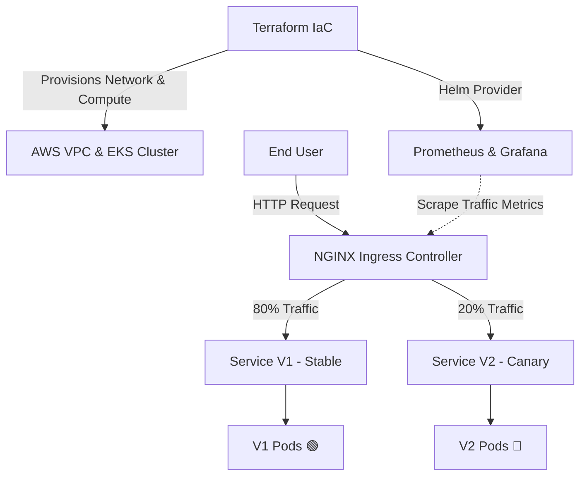

# AWS Infrastructure Automation & Progressive Delivery (Canary)

A production-grade **Site Reliability Engineering (SRE)** laboratory that orchestrates a highly available cloud infrastructure and executes a **Zero-Downtime Canary Deployment** driven by metrics.

## 🚀 Engineering Scope

This project implements a **Platform Engineering** workflow separating Infrastructure as Code (Terraform) from Application Workloads (Kubernetes Manifests).

* **Immutable Cloud Infrastructure:** Full lifecycle management of a secure AWS network topology (VPC, Private/Public Subnets, NAT Gateway) and Compute (EKS Cluster).
* **Progressive Delivery (Canary):** Implementation of an 80/20 traffic split strategy using NGINX Ingress annotations to mitigate the risks of releasing new features.
* **Zero-Downtime Rollback:** Instant traffic routing manipulation to revert 100% of users to a stable version seamlessly without dropping active connections.
* **Observability by Design:** Automated deployment of the `kube-prometheus-stack` via Helm directly within Terraform for real-time traffic and application monitoring.

## 📐 Architecture

## 🛠 Tech Stack

| Component | Technology | Role |
| :--- | :--- | :--- |
| **Provisioning** | **Terraform** | State-managed infrastructure creation (HCL). |
| **Cloud** | **Amazon Web Services** | VPC, NAT Gateway, EKS (Elastic Kubernetes Service). |
| **Orchestration** | **Kubernetes** | Container lifecycle management (Deployments, Services). |
| **Traffic Mgmt** | **NGINX Ingress** | Traffic shaping, weighted routing, and entry point. |
| **Observability** | **Helm & Prometheus** | Package management and real-time metric scraping. |

## ⚙️ Repository Structure & Execution

The project enforces a strict separation of concerns:

### 1. Infrastructure Foundation (`/terraform`)
Contains the HCL manifests required to build the underlying AWS architecture.
* Execution involves standard IaC workflow: `terraform init`, `terraform fmt`, and `terraform plan` / `terraform apply`.
* *Security Note:* State files and `.terraform` directories are strictly ignored via `.gitignore` to prevent secret leakage.

### 2. Application Workload (`/k8s`)
Contains the Kubernetes manifests representing the application lifecycle.
* **`app-v1.yaml`**: Deploys the stable green release.
* **`app-v2.yaml`**: Deploys the new canary blue release.
* **`ingress.yaml`**: Contains the magic `canary-weight: "20"` annotation. By changing this value to `0` and applying (`kubectl apply -f ingress.yaml`), an instant rollback is achieved.

---
*DevOps Engineering Portfolio Project*