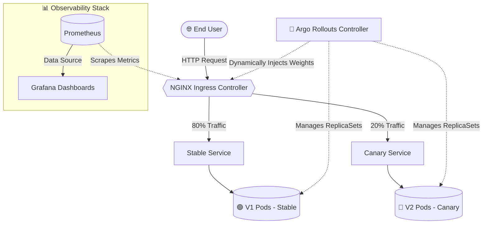

# AWS Infrastructure Automation & Progressive Delivery (Canary)


A production-grade **Site Reliability Engineering (SRE)** laboratory that orchestrates a highly available cloud infrastructure and executes an **Automated Zero-Downtime Canary Deployment** driven by metrics and **Argo Rollouts**.

## 🚀 Engineering Scope

This project implements a **Platform Engineering** workflow separating Infrastructure as Code (Terraform) from Application Workloads (Kubernetes Manifests), evolving from manual routing to automated declarative deployments.

* **Immutable Cloud Infrastructure:** Full lifecycle management of a secure AWS network topology (VPC, Private/Public Subnets, NAT Gateway) and Compute (EKS Cluster).
* **Automated Progressive Delivery:** Implementation of an intelligent Canary release strategy using the `Rollout` Custom Resource Definition (CRD). Argo Rollouts dynamically injects weights into a shadow NGINX Ingress to control traffic flow (e.g., 20% -> Pause -> 80% -> 100%).
* **Zero-Downtime Rollback & SRE Ops:** Instant traffic routing manipulation via Argo CLI to revert 100% of users to a stable version seamlessly without dropping active connections during an incident.
* **Observability by Design:** Automated deployment of the `kube-prometheus-stack` via Helm directly within Terraform for real-time traffic and application monitoring.

## 📐 Architecture


```mermaid
graph TD;
    User([🌐 End User]) -->|HTTP Request| Ingress{{NGINX Ingress Controller}};
    Argo[🐙 Argo Rollouts Controller] -.->|Dynamically Injects Weights| Ingress;

    Ingress -->|80% Traffic| SVC1[Stable Service];
    Ingress -->|20% Traffic| SVC2[Canary Service];

    SVC1 --> Pods1[(🟢 V1 Pods - Stable)];
    SVC2 --> Pods2[(🔵 V2 Pods - Canary)];
    
    Argo -.->|Manages ReplicaSets| Pods1;
    Argo -.->|Manages ReplicaSets| Pods2;

    subgraph Observability [📊 Observability Stack]
        Prometheus[(Prometheus)]
        Grafana[Grafana Dashboards]
        Prometheus -->|Data Source| Grafana
    end

    Prometheus -.->|Scrapes Metrics| Ingress;
```

## 🛠 Tech Stack

| Component | Technology | Role |
| :--- | :--- | :--- |
| **Provisioning** | **Terraform** | State-managed infrastructure creation (HCL). |
| **Cloud** | **Amazon Web Services** | VPC, NAT Gateway, EKS (Elastic Kubernetes Service). |
| **Orchestration** | **Kubernetes** | Container lifecycle management. |
| **Progressive Delivery**| **Argo Rollouts** | Controller for automated Canary steps and ReplicaSet management. |
| **Traffic Mgmt** | **NGINX Ingress** | Traffic shaping and entry point (Controlled by Argo). |
| **Observability** | **Helm & Prometheus** | Package management and real-time metric scraping. |

## ⚙️ Repository Structure & Execution

The project enforces a strict separation of concerns:

### 1. Infrastructure Foundation (`/terraform`)
Contains the HCL manifests required to build the underlying AWS architecture and install cluster controllers.
* Execution involves standard IaC workflow: `terraform init`, `terraform fmt`, and `terraform apply`.
* *Automation:* Provisions the Argo Rollouts controller and Prometheus stack directly via the Terraform Helm provider.

### 2. Application Workload (`/k8s`)
Contains the Kubernetes manifests representing the application lifecycle using GitOps principles.
* **`rollout.yaml`**: The core CRD replacing standard Deployments. It defines the Canary steps (20% -> pause -> 80%), thresholds, and container specs. 
* **`services.yaml`**: Defines both the Stable and Canary entry points.
* **`ingress.yaml`**: A clean, declarative ingress routing definition (Argo manages the weighted annotations under the hood).

### 🚨 SRE Operations (CLI)
Once a new image tag/hash is updated in the `rollout.yaml`, Argo triggers the Canary. The SRE team manages the state via CLI:

```bash
# Monitor the rollout status and step progression in real-time
kubectl argo rollouts get rollout app-rollout --watch

# Approve the canary release (Promote from paused 20% to 80%)
kubectl argo rollouts promote app-rollout

# Emergency Rollback (Instantly shifts traffic back to 100% Stable)
kubectl argo rollouts abort app-rollout
```

---
*DevOps & SRE Engineering Portfolio Project*